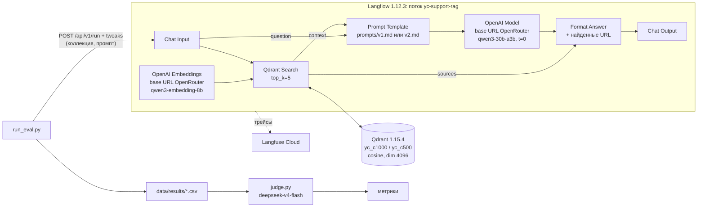

# RAG-ассистент по документации Yandex Cloud

RAG-ассистент для первой линии поддержки: отвечает по русской документации Yandex Cloud (Compute Cloud, Object Storage, VPC, Billing) со ссылками на страницы. Поток собран в Langflow, трейсы идут в Langfuse, качество измеряется воспроизводимым прогоном на 40 вопросах.

## Задача и требования

Пользователь — специалист первой линии поддержки. Хороший ответ короткий, опирается только на найденные фрагменты, содержит ссылку на страницу документации, а если ответа в базе нет — прямо говорит об этом. Рамки, критерии и пороги метрик зафиксированы до первого замера: [docs/requirements.md](docs/requirements.md).

| Метрика | Порог |
|---|---|
| Доля верных ответов (вопросы с ответом в базе) | ≥ 80% |
| Доля корректных отказов (вопросы без ответа и не по теме) | ≥ 90% |
| Ссылка на источник в ответе | 100% |
| hit@5 поиска | ≥ 85% |

## Архитектура



- Поток собирается скриптом [`scripts/build_flow.py`](scripts/build_flow.py) через REST API Langflow и экспортируется в [`flows/answer.json`](flows/answer.json).
- В Langflow 1.12.3 нет компонента Qdrant (он вынесен в пакет, которого нет на PyPI) и нет компонента OpenRouter. Поэтому поиск и форматирование ответа — пользовательские компоненты [`flows/components/`](flows/components/), а эмбеддинги и LLM — компоненты OpenAI с базовым URL OpenRouter.
- Коллекция и текст промпта переопределяются в каждом вызове через `tweaks`. Режим без поиска (`A`) — тот же поток с шаблоном [`prompts/norag.md`](prompts/norag.md) без `{context}`: та же модель и те же трейсы.
- id трейса Langfuse возвращается в ответе `/run` (`session_metadata.langfuse_trace_id`) и сохраняется в результатах.

## Модели

ID взяты из актуального списка OpenRouter (`/api/v1/models`, `/api/v1/embeddings/models`). Цены — за 1M токенов на момент прогона, по `common.model_price`.

| Роль | Модель | Цена вход / выход | Почему |
|---|---|---|---|
| Ответы | `qwen/qwen3-30b-a3b-instruct-2507` | $0.048 / $0.193 | дешёвая instruct-модель без reasoning, хорошо пишет по-русски |
| Вопросы и судья | `deepseek/deepseek-v4-flash-0731` | $0.018 / $0.32 | сильнее модели ответов и дешёвая на входе (судья читает весь контекст); reasoning отключён через `extra_body.reasoning.enabled=false` |
| Эмбеддинги | `qwen/qwen3-embedding-8b` (dim 4096) | — | лучше разделяет русские пары, чем `baai/bge-m3` (см. ниже) |

Проверка эмбеддингов на 5 русских парах «вопрос — релевантный абзац» ([`scripts/check_embeddings.py`](scripts/check_embeddings.py)). В обеих моделях каждая пара на первом месте. У qwen отрыв своей пары от лучшей чужой больше:

| Модель | Средняя близость своей пары | Лучшая чужая | Отрыв |
|---|---|---|---|
| `qwen/qwen3-embedding-8b` | 0.752 | 0.385 | 0.367 |
| `baai/bge-m3` | 0.743 | 0.419 | 0.324 |

Запросы эмбеддятся с инструкцией Qwen3-Embedding (`common.QUERY_INSTRUCTION`), документы — без неё; в потоке используется тот же префикс.

## Корпус

- Источник: [yandex-cloud/docs](https://github.com/yandex-cloud/docs), клон `--depth 1`, коммит **`b54e74c8dd2e49a0355494a9a539be8ac1eca7e7`**.
- Разделы: `ru/{compute,storage,vpc,billing}/` — concepts, operations, qa, quickstart, pricing (для billing ещё payment и usage). Без `api-ref`, `cli-ref`, tutorials и release notes.
- Страниц: **453** (Compute Cloud 249, Object Storage 76, VPC 63, Billing 65).
- Токенов: **1 359 866** (оценка по `cl100k_base`).
- Очистка (`scripts/prepare_corpus.py`): удаляется front matter; `` разворачиваются рекурсивно, в том числе фрагменты по якорю; `{{ переменные }}` подставляются из `presets.yaml`; ссылки `[{#T}](page.md)` заменяются заголовком целевой страницы; вкладки `` превращаются в подзаголовки; `note` и `cut` раскрываются; YFM-таблицы `#| … |#` приводятся к строкам.
- URL строятся из пути файла: `ru/compute/concepts/limits.md` → `https://yandex.cloud/ru/docs/compute/concepts/limits`. Три URL проверены вручную, страницы открываются.
- **Ограничение:** конкретных цен в репозитории нет. Они подставляются из прайс-листа при сборке сайта (`{{ sku|RUB|… }}`, `<PriceList>`), поэтому в корпусе вместо них стоят заглушки `<цена …>`. Вопросы «с числами» строятся на лимитах, размерах и сроках.

## Индексация

Чанки режутся по заголовкам Markdown, соседние короткие секции склеиваются, длинные делятся по размеру с перекрытием 100 токенов (`cl100k`). В payload: `url`, `title`, `service`, `chunk_index`, `text`.

| Коллекция | Размер чанка | Точек |
|---|---|---|
| `yc_c1000` | 1000 | 1994 |
| `yc_c500` | 500 | 3920 |

## Тестовые вопросы

[`data/questions.csv`](data/questions.csv), 40 вопросов, сгенерированы [`scripts/gen_questions.py`](scripts/gen_questions.py) в формулировках сотрудников поддержки.

| Тип | Всего | dev | holdout |
|---|---|---|---|
| факт из одной страницы | 10 | 7 | 3 |
| процедура | 8 | 6 | 2 |
| несколько страниц | 5 | 4 | 1 |
| число (лимит, размер, срок) | 6 | 4 | 2 |
| нет ответа в корпусе | 8 | 7 | 1 |
| не по теме / попытка сбить инструкцию | 3 | 2 | 1 |

- Эталоны вопросов с ответом сверены со страницами автоматически: модель приводит дословные цитаты ([`data/questions_evidence.jsonl`](data/questions_evidence.jsonl)), скрипт проверяет, что каждая цитата есть в тексте страницы.
- Вопросы без ответа проверены поиском по всему корпусу: сильная модель просмотрела топ-10 чанков `yc_c1000` и подтвердила, что ответа нет. Кандидатов, на которые ответ нашёлся, отбросили (для Billing — 5 из 7).
- 30 dev-вопросов дополнительно проверены вручную по страницам; четыре правки лежат в `MANUAL_FIXES` с причинами. Holdout при проверке и при работе с промптами не читался.

## Эксперименты

Все прогоны с температурой 0, 40 вопросов. dev: 21 вопрос с ответом и 9 на отказ. holdout: 8 с ответом и 2 на отказ, поэтому один вопрос holdout сдвигает долю верных на 12.5 п. п., а долю отказов — на 50 п. п.

| | Что менялось | Верно, dev / holdout | Корр. отказ, dev / holdout | Галлюцинации, dev / holdout | Ссылка | hit@5, dev / holdout | MRR, dev / holdout |
|---|---|---|---|---|---|---|---|
| A | без поиска | 24% / 38% | 22% / 0% | 40% / 40% | 0% | — | — |
| B | `yc_c1000`, промпт v1 | 71% / 100% | 44% / 0% | 17% / 20% | 100% | 90% / 100% | 0.68 / 0.75 |
| C | `yc_c1000`, промпт v2 | 67% / 75% | 56% / 100% | 13% / 0% | 100% | 90% / 100% | 0.68 / 0.75 |
| D | `yc_c500`, промпт v2 | 76% / 100% | 56% / 100% | 13% / 0% | 100% | 90% / 100% | 0.79 / 0.81 |

«Верно» — доля метки `верно` среди вопросов с ответом. «Корр. отказ» — доля `корректный_отказ` среди вопросов без ответа и не по теме. «Галлюцинации» — доля метки `галлюцинация` среди всех вопросов split. «Ссылка» — доля ответов со ссылкой `yandex.cloud/ru/docs` среди вопросов с ответом, одинаковая на dev и holdout. Полная таблица и разбивка по типам: `python scripts/judge.py --report A B C D`, файл [`data/results/summary.md`](data/results/summary.md).

Выводы:
- **A:** без поиска модель верно отвечает на 24% dev-вопросов и галлюцинирует в 40%: лимиты и названия выдумываются. Например, на проверочном вызове в том же режиме модель ответила «в одном облаке можно создать неограниченное количество облачных сетей», а по документации квота по умолчанию — 2 сети на облако.
- **B:** поиск поднимает верные ответы до 71% на dev и даёт ссылку в каждом ответе, но промпт v1 почти не отказывает: 44% корректных отказов, на остальные вопросы без ответа модель отвечает по смежным страницам.
- **C:** промпт v2 поднимает долю отказов до 56% и снижает галлюцинации до 13%. Доля верных (67%) ниже, чем у B, но разница — один вопрос, меньше разброса.
- **D:** чанки по 500 токенов поднимают MRR с 0.68 до 0.79 при том же hit@5. Верных на dev 76% — лучший результат, но отличие от B и C сопоставимо с разбросом.

Лучшая конфигурация выбрана по dev — **D**. Порог по ссылкам (100%) и по hit@5 (≥ 85%) выполнен. Пороги по верным ответам (80%, на dev 71–76%) и по корректным отказам (90%, на dev 56–67%) не достигнуты.

### Разброс

Конфигурация D прогнана трижды: ответы и оценки судьи получены заново, поиск детерминирован.

| Прогон | Верно, dev / holdout / все | Корр. отказ, dev / holdout / все | Галлюцинации, dev / все |
|---|---|---|---|
| D | 76% / 100% / 83% | 56% / 100% / 64% | 13% / 10% |
| D_run2 | 71% / 100% / 79% | 67% / 100% / 73% | 10% / 8% |
| D_run3 | 76% / 100% / 83% | 67% / 100% / 73% | 10% / 8% |

При температуре 0 доля верных на dev колеблется в пределах 71–76% (один вопрос из 21), доля отказов — 56–67% (один вопрос из 9). Разница между B, C и D по верным ответам (67–76%) не больше этого разброса, поэтому по верным ответам конфигурации B, C и D на 40 вопросах не различимы. Устойчивые различия: RAG против A по всем метрикам и v2 против v1 по отказам.

### Проверка судьи

20 случайных меток судьи выгружены в [`data/results/manual_check.csv`](data/results/manual_check.csv) (`python scripts/judge.py --sample-manual A B C D`). Человек заполнил столбец `human_label`, доля совпадений считается командой `python scripts/judge.py --agreement`: **20 из 20 (100%)**. Выборка мала: она подтверждает, что грубых ошибок судьи нет, но не доказывает точность на спорных границах меток.

## Как запустить с нуля

Нужны Python 3.11+, Docker, ключ OpenRouter и ключи Langfuse Cloud.

```bash
git clone <этот репозиторий> && cd rag-yandex-cloud
python -m venv .venv && . .venv/bin/activate      # Windows: .venv\Scripts\activate
pip install -r requirements.txt
cp .env.example .env                              # заполнить OPENROUTER_API_KEY и LANGFUSE_*
```

Корпус на зафиксированном коммите документации:
```bash
git clone --depth 1 https://github.com/yandex-cloud/docs yc-docs
git -C yc-docs fetch --depth 1 origin b54e74c8dd2e49a0355494a9a539be8ac1eca7e7
git -C yc-docs checkout b54e74c8dd2e49a0355494a9a539be8ac1eca7e7
python scripts/prepare_corpus.py                  # -> data/corpus.jsonl, 453 страницы
```

Qdrant и Langflow (Langflow без логина, порты только на localhost):
```bash
docker compose up -d
```

Индексация (сначала `--dry-run` показывает оценку стоимости; обе коллекции обошлись примерно в $0.09):
```bash
python scripts/ingest.py --chunk-size 1000 --collection yc_c1000 --yes
python scripts/ingest.py --chunk-size 500 --collection yc_c500 --yes
python scripts/ingest.py --collection yc_c1000 --query "как назначить ВМ статический IP"
```

Поток и оценка:
```bash
python scripts/build_flow.py                      # поток в Langflow, flows/answer.json, flows/flow_id.txt
python scripts/run_eval.py --config D --dry-run   # оценка стоимости
for c in A B C D; do python scripts/run_eval.py --config $c && python scripts/judge.py --config $c; done
python scripts/judge.py --report A B C D
python scripts/check_traces.py                    # trace_id из результатов найдены в Langfuse
```

`data/questions.csv` уже в репозитории. `python scripts/gen_questions.py --dry-run` / `--yes` генерирует вопросы заново, но результат будет отличаться: генерация недетерминирована, а ручные правки привязаны к id.

Скрипты на Windows запускайте с `PYTHONIOENCODING=utf-8`.


## Известные ограничения

- **Привязка к коммиту документации.** База собрана на коммите `b54e74c8`. Лимиты и процедуры в документации меняются, эталоны тоже привязаны к этому коммиту.
- **Цены.** В исходниках документации цен нет (заглушки `<цена …>`), поэтому ассистент не отвечает на вопросы о стоимости, а в тесте таких вопросов нет.
- **40 вопросов.** Один вопрос dev — это 4.8 п. п. доли верных и 11 п. п. доли отказов, а holdout из 10 вопросов почти ничего не говорит о разнице конфигураций. Различия меньше разброса (см. «Разброс») считать улучшением нельзя.
- **Вопросы и эталоны сгенерированы моделью.** Формулировки сотрудников имитированы. Эталоны проверены по цитатам, dev — ещё и вручную, holdout ждёт ручной проверки.
- **Поведение судьи.** Судья — тоже LLM. В исходной рубрике он поставил `верно` вопросу, где ожидался отказ, поэтому рубрика уточнена, а недопустимые для `should_refuse` метки отправляются на повтор. Граница между `частично` и `верно` и между `неверно` и `галлюцинация` размыта. Согласие с человеком на 20 случайных метках — 20 из 20, но выборка мала.
- **Время ответа.** 14–22 с на вопрос измерены при 4 параллельных запросах к Langflow. Одиночный запрос идёт 8–12 с, первый после старта — около 30 с.
- **Трейсы.** У 3 из 40 запусков первого прогона D нет трейса: Langflow не смог подключиться к Langfuse (SSL handshake timeout) и выполнил поток без трассировки. Трейсы появляются в Langfuse с задержкой в несколько минут. Старый API `/api/public/traces` для новых организаций отключён, `check_traces.py` использует `/api/public/v2/observations`.


## Что не получилось

- **Отказы.** Даже с промптом v2 модель отвечает примерно на половину вопросов, ответа на которые в документации нет. Она достраивает ответ по смежной странице: например, «при перемещении подсети статические IP сохраняются» или «грант не переносится между аккаунтами». Порог 90% не достигнут. Вероятные пути: более строгий промпт с примерами отказа, отдельный шаг проверки «есть ли ответ в контексте», более сильная модель ответов. Всё это нужно проверять на dev и сравнивать с разбросом.
- **Верные ответы.** На dev 71–76% при пороге 80%. Основные потери — вопросы на несколько страниц (чаще `частично`) и ложные отказы v2 на вопросы, где ответ есть в контексте.
